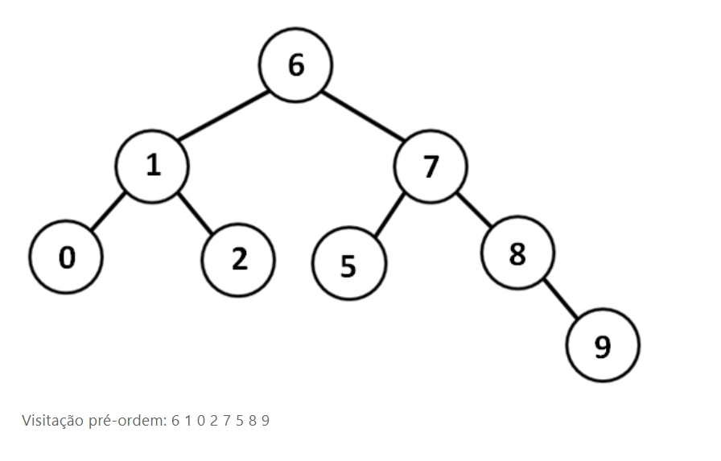

# Árvore Binária

Nesta atividade, foi construído uma árvore binária utilizando o método `pré-ordem`, ou seja, partindo da raiz e imprimindo na tela os nós visitados.

## `Descrição da Atividade`:
Considere que, no seu primeiro estágio, ao realizar um teste no seu programa que implementa árvores binárias, você inseriu os números de seu `RA` (da esquerda para a direita) como se cada algarismo fosse um nó na árvore. Dessa forma, altere o código-fonte dado para que seu programa, durante a execução, monte uma árvore binária a partir dos dígitos de seu `RA`. 

O seu programa `não` deve realizar a inserção automaticamente ordenada, ou seja, não é preciso desenvolver um método que realize a inserção ordenadamente. Você mesmo pode construir a árvore (via inserções simples, porém seguindo as regras de inserção ordenada), de maneira a compor a árvore ordenada com os números de seu `RA`. 
Além disso, você precisará criar uma função que seja capaz de realizar o percurso pré-ordem na árvore recém-criada, partindo da raiz e imprimindo na tela os nós visitados de acordo com esse método.



## Projeto Implementado em C:
`RA Utilizado: 210342105`

```c
#include <stdio.h>
#include <stdlib.h>
#include <locale.h>
#include <math.h>

/*
            ATIVIDADE MAPA - ESTRUTURA DE DADOS 2
            Aluna: Kelly Prone de Oliveira
            RA: 21034210-5
            Limeira - SP

*/

typedef struct no{
    int valor;
    struct no *direita, *esquerda;
}NoArv;

NoArv* imprimir_arvore(NoArv *raiz, int num){
    setlocale(LC_ALL, "Portuguese");
    if(raiz == NULL){
        NoArv *aux = malloc(sizeof(NoArv));
        aux->valor = num;
        aux->esquerda = NULL;
        aux->direita = NULL;
        return aux;
    }
    else{
        if(num < raiz->valor)
            raiz->esquerda = imprimir_arvore(raiz->esquerda, num);
        else
            raiz->direita = imprimir_arvore(raiz->direita, num);
        return raiz;
    }
}

void preordem(NoArv *raiz){
    if(raiz){
        printf("%d ", raiz->valor);
        preordem(raiz->esquerda);
        preordem(raiz->direita);
    }
}

int main(){
	setlocale(LC_ALL, "Portuguese");
    NoArv *raiz = NULL;
    int opcao, valor;

    do{
    	printf("MAPA - ESTRUTURA DE DADOS 2\n");
    	printf("Kelly Prone de Oliveira\n\n");
    	printf("Menu Principal:\n");
        printf("\n\t0 - Sair\n\t1 - Inserir\n\t2 - Imprimir\n");
        scanf("%d", &opcao);
        system("cls");

        switch(opcao){
        case 1:
            printf("\nDigite um valor: ");
            printf("\n--> ");
            scanf("%d", &valor);
            raiz = imprimir_arvore(raiz, valor);
            system("cls");
            break;
        case 2:
            printf("\nImprimindo Árvore:\n");
            preordem(raiz);
            printf("\n\n");
            printf("****PROGRAMA FINALIZADO!****\n\n");  
            break;
        default:
            if(opcao != 0)
                printf("\nOpção inválida!!!\n");
                printf("\nDigite Novamente...\n");
        }
    }while(opcao != 0);
    
    return 0;
}

```

## Sobre a Árvore Binária:
Cada nó possui pelo menos três valores: uma referência para o pai do nó, uma referência para o filho à esquerda do nó e mais uma outra referência para o filho à direita do respectivo nó. O atributo "pai" vai apontar para a posição na qual o pai do nó se encontra, no vetor. O atributo "esquerda" vai armazenar a posição da raiz da sub-árvore à esquerda do nó, e o atributo "direita" guarda a posição da raiz da sub-árvore direita do nó, no vetor. 

É possível adicionar algumas regras à inserção de dados em uma árvore para que ela se torne ordenada. Assim, sempre que um novo dado estiver para ser adicionado junto à árvore, ele será comparado com o nó raiz. Se ele é menor do que a raiz, deverá ser adicionado na sub-árvore esquerda, caso contrário na sub-árvore direita.

```
Obrigada por chegar até aqui! =)
```

